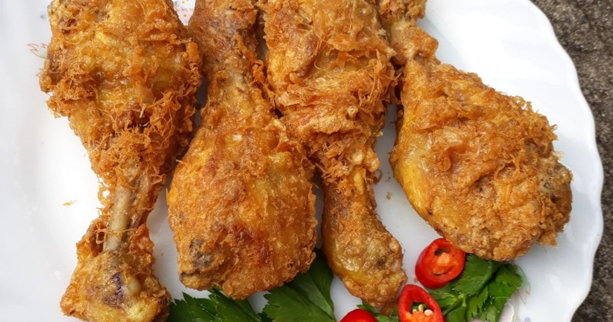

# 🍱 AI Food Detection with Nutrition Information

A web-based application that detects food items in an uploaded image using **YOLOv8**, and displays their estimated **nutritional information** (calories, protein, fat, carbs) based on a CSV dataset.

Built with:
- 🧠 [Ultralytics YOLOv8](https://github.com/ultralytics/ultralytics) for object detection
- 🧪 Flask for the backend
- 🗂️ Pandas for nutrition data handling
- 🖼️ OpenCV for image processing

---

## 📷 Demo

> Upload a food image, and the app will detect the food and show you nutrition info per 100g.

 <!-- Change this to your best result -->

---

## 🏗️ Features

- Upload a food image via browser
- Run detection with YOLOv8 `.pt` model
- Match detected food with nutritional data from `nutrition_data.csv`
- Show calories, protein, fat, and carbohydrates per detected item
- Lightweight UI with live image and results

---

## 🚀 Installation

1. **Clone this repo**

```bash
git clone https://github.com/Ahmad-FikriA/ai_food_detection.git
cd ai_food_detection

```
**2. Create a Virtual Environment**
```bash
Copy
Edit
python -m venv .venv
source .venv/bin/activate        # On Windows: .venv\Scripts\activate
```
**3. Install Dependencies**
```bash
Copy
Edit
pip install -r requirements.txt
```

**4. Add YOLOv8 Model**
```bash
Put your trained YOLOv8 model file in:

swift
Copy
Edit
runs/detect/train/weights/best.pt
Note: Do not upload .pt files to GitHub — keep them local or use cloud links.
```

**5. Run the App**
```bash
Copy
Edit
python app.py
Then open your browser at:
http://127.0.0.1:5000
```